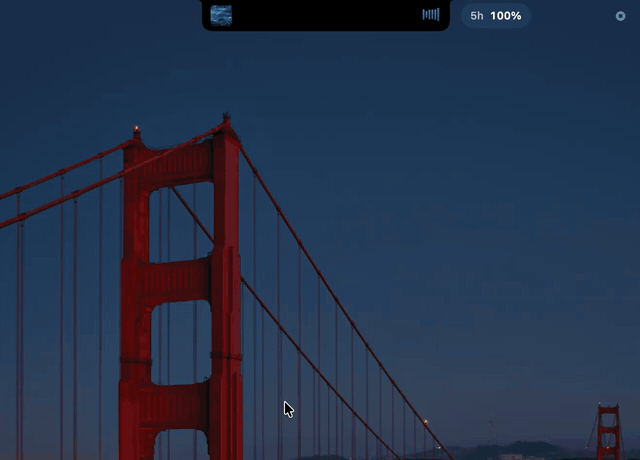

# Boring Notch Octave

**Give your Mac’s notch a little more to do.** Boring Notch Octave turns it into a compact home for music, lyrics, your files, upcoming events, focus sessions, and more.

This independently maintained macOS fork builds on [TheBoredTeam’s Boring Notch](https://github.com/TheBoredTeam/boring.notch) and adds a Brave + Octave music experience alongside new tools and interface updates.

**[Download for macOS](https://github.com/vedanth-jadhav/boring/releases/latest)** · [Install guide](RELEASE_INSTALL.md) · [Brave + Octave setup](LOCAL_OCTAVE.md)

## See it in action

[](assets/boring-notch-octave-demo.mp4)

[The preview plays automatically at 24 fps. Click it to watch the full 30-second MP4 at the recording’s original resolution and frame rate.](assets/boring-notch-octave-demo.mp4)

## Features

### The Boring Notch essentials

- **Music at a glance:** see what’s playing, follow a live activity, and control playback from the notch, with a music visualizer.
- **Shelf for the things you’re moving:** drag files into the notch to keep them handy, preview or share them, and use AirDrop. Shelf also includes screenshot capture and file tools.
- **Your day, close by:** check calendar events and reminders from the notch.
- **Useful Mac controls:** get glanceable battery and charging status, a camera mirror, gesture controls, and notch sizing options.
- **System overlays:** bring volume, brightness, and keyboard backlight feedback into the notch.

### What this fork adds

- **Octave in Brave:** connect Octave playback to the notch with playback controls, audio visualization, and lyrics. The integration uses a Brave extension and a native bridge.
- **Enhanced karaoke lyrics:** show word-level timing and a smooth vocal shimmer when the source provides timing data. Optional romanization supports Hindi, Punjabi, and Urdu. Lyrics are cached locally.
- **Focus sessions:** start and manage a focus timer from the notch.
- **Codex usage:** view local Codex session history and plan allowance in the app.
- **Shelf tools:** convert images and PDFs, compress files, and share the result.
- **A refreshed interface:** updated glass treatments, music layouts, and lyric presentation, with fallbacks for older supported macOS versions.

## Download and install

1. Download the latest **Boring Notch Octave** DMG from [Releases](https://github.com/vedanth-jadhav/boring/releases/latest).
2. Open the DMG and drag **Boring Notch Octave** to **Applications**.
3. In Applications, Control-click the app, choose **Open**, then confirm **Open**. This release is not signed with an Apple Developer ID, so macOS asks for approval the first time.

If macOS blocks the app, go to **System Settings → Privacy & Security → Open Anyway**, then Control-click and open it again. If **Open Anyway** is unavailable, remove the quarantine flag from this app in Terminal:

```sh
xattr -dr com.apple.quarantine "/Applications/Boring Notch Octave.app"
```

Then open the app from Applications. See the [complete install guide](RELEASE_INSTALL.md) for first launch and download verification. The Octave in Brave feature also needs the [one-time extension setup](LOCAL_OCTAVE.md).

This build has a separate app identity and no automatic updater. Get updates from this repository’s releases.

## Optional: enhanced lyrics

Enhanced lyrics are off by default. To enable them, open **Settings → Media → Enhanced lyrics**, create a personal key in the [Spicy Lyrics developer dashboard](https://developers.spicylyrics.org/dashboard/applications), and save it in the app. The key is stored in macOS Keychain and can be removed in settings. The app checks the key before saving it.

When enhanced lyrics are enabled, the current track’s title, artist, album, and duration are used to identify it through MusicBrainz. A matching track is then sent to Spicy Lyrics with your key. Results are cached locally.

## Privacy notes

- The Codex view reads session history and `auth.json` from your selected Codex folder, normally `~/.codex`. It requests plan allowance from `chatgpt.com` and public model pricing from `developers.openai.com` when you open the Codex tab. Session history stays on your Mac and is not uploaded.
- Shelf screenshot retention is off by default. When enabled, newly captured screenshots are saved in the app’s local Shelf library. Turning retention off stops future imports; it does not delete screenshots already saved.
- The camera mirror uses camera access only to show a live preview. It does not record or store video.

## Build from source

The app supports macOS 14 and later. Building locally currently requires Apple Command Line Tools for Xcode 27, including the macOS 27 SDK and Swift 6.4. See [LOCAL_OCTAVE.md](LOCAL_OCTAVE.md) for the full build and Brave setup instructions.

```sh
git clone https://github.com/vedanth-jadhav/boring.git
cd boring
bash Scripts/install_local.sh release
```

The installer builds and signs the app with a local signing identity, archives older installed copies, installs and launches the build, then verifies the running executable. Use `bash Scripts/install_local.sh debug` for active development.

## Fork and license

Boring Notch Octave is a **fork** of [TheBoredTeam/boring.notch](https://github.com/TheBoredTeam/boring.notch), based on upstream commit [`fb26431`](https://github.com/TheBoredTeam/boring.notch/commit/fb2643121741c6ba6102d5ef2b2c7a787f26fad1). It is maintained independently and is **not an official release of TheBoredTeam**. [Compare this fork with its upstream baseline](https://github.com/vedanth-jadhav/boring/compare/fb2643121741c6ba6102d5ef2b2c7a787f26fad1...main).

This fork preserves the upstream **GNU General Public License v3.0 (GPL-3.0)**, keeps the required notices and third-party attributions, and publishes its source in this repository alongside its releases. The app’s original authorship remains credited to TheBoredTeam; the Octave integration and changes described here are maintained by [Vedanth Jadhav](https://github.com/vedanth-jadhav). See [LICENSE](LICENSE) and [THIRD_PARTY_LICENSES](THIRD_PARTY_LICENSES) for the license texts and attributions.
